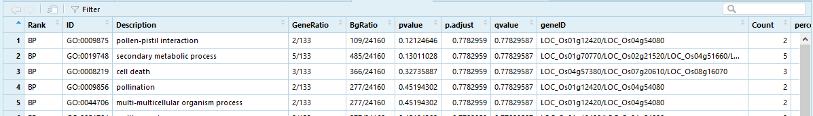

# GO 富集结果_ggplot2 绘图   

```r
library(ggplot2)
MSU_160_GO<-read.csv("C:\\Users\\zhuwengen\\Desktop\\tangyimiao\\GO\\MSU_160_GO.csv",stringsAsFactors = TRUE)
colnames(MSU_160_GO)      # 绘图主要使用"Rank"，"Description" ，"Count" 列
[1] "Rank"             "ID"               "Description"      "GeneRatio"        "BgRatio"         
[6] "pvalue"           "p.adjust"         "qvalue"           "geneID"           "Count"           
[11] "percent_of_genes"
```

MSU_160_GO 数据结构,如下图 
  
      

## 分面！绘图  
```
ggplot(data = MSU_160_GO, mapping = aes(reorder(Description,Count),Count, fill=Rank)) +
        geom_bar(aes(fill=Rank),stat= 'identity', width = 0.5) +
        facet_grid(~Rank,space="free_x", scales="free_x") + 
         #换个角度显示，angle是控制刻度标签显示的角度 + 
        theme(axis.text.x = element_text(angle=30, hjust=1, vjust=1))
```
 
      


用 Abraham Lincoln 的话来说：

> 原谅我爆粗口

### 三基因组共线性分析
本教程参考：[MCscan (Python version)官网](https://genehub.wordpress.com/2019/07/05/mcscanx-%E6%B5%8B%E8%AF%95/)，有修改！

#### 第一步：准备分析环境  
```
$ conda create -n jcvi python=2.7   # 如已创建该环境，请忽略这步
$ conda install jcvi last scipy     # 如已经安装这些模块，请忽略这步

$ conda activate jcvi                               # 激活已经安装jcvi模块的jcvi环境
$ mkdir Grape.Peach.Cacao  | cd Grape.Peach.Cacao   # 在mcscan_between_genome目录下创建
```

#### 第二步：下载、解压桃🍑、葡萄🍇、可可🥥的 gff和cds 数据  
下载： Prunus persica (peach)、Vitis vinifera L.(grape)、Theobroma cacao(cacao)的cds 和 gff文件

```
$ ls
Ppersica_298_v2.1.cds.fa.gz     Tcacao_523_v2.1.cds.fa.gz     Vvinifera_145_Genoscope.12X.cds.fa.gz
Ppersica_298_v2.1.gene.gff3.gz  Tcacao_523_v2.1.gene.gff3.gz  Vvinifera_145_Genoscope.12X.gene.gff3.gz

$ gunzip *gz

$ ll
-rw-rw-r-- 1 manager manager 71828035 May  5 12:58 Ppersica_298_v2.1.cds.fa
-rw-rw-r-- 1 manager manager 61401929 May  5 12:58 Ppersica_298_v2.1.gene.gff3
-rw-rw-r-- 1 manager manager 58569425 May  5 12:57 Tcacao_523_v2.1.cds.fa
-rw-rw-r-- 1 manager manager 54953955 May  5 12:57 Tcacao_523_v2.1.gene.gff3
-rw-rw-r-- 1 manager manager 34297711 May  5 12:57 Vvinifera_145_Genoscope.12X.cds.fa
-rw-rw-r-- 1 manager manager 34622840 May  5 12:57 Vvinifera_145_Genoscope.12X.gene.gff3
```


#### 第三步：将gff转成bed格式  
**注意**：本文的物种参数设置为 `--key=Name`，即选转录本id；有些物种选`--key=ID`，具体需要先查看gff文件。
```
$ python -m jcvi.formats.gff bed --type=mRNA --key=Name Tcacao_523_v2.1.gene.gff3 -o cacao.bed
$ python -m jcvi.formats.gff bed --type=mRNA --key=Name Ppersica_298_v2.1.gene.gff3 -o peach.bed
$ python -m jcvi.formats.gff bed --type=mRNA --key=Name Vvinifera_145_Genoscope.12X.gene.gff3 -o grape.bed  

# 可也对bed文件中的基因进行去重(可不用此步骤)  
$ python -m jcvi.formats.bed uniq cacao.bed  
$ python -m jcvi.formats.bed uniq peach.bed  
$ python -m jcvi.formats.bed uniq grape.bed  
```  

#### 第四步：准备CDS序列   
```
$ python -m jcvi.formats.fasta format --sep="|" Tcacao_523_v2.1.cds.fa cacao.cds 
$ python -m jcvi.formats.fasta format --sep="|" Ppersica_298_v2.1.cds.fa peach.cds 
$ python -m jcvi.formats.fasta format --sep="|" Vvinifera_145_Genoscope.12X.cds.fa grape.cds 

# 这一步很重要！！！需要先查看cds序列，然后用正则表达式替换！   
$ sed  -i 's#pacid.*##' cacao.cds  
$ sed  -i 's#pacid.*##' peach.cds  
$ sed  -i 's#pacid.*##' grape.cds    
```  

#### 第五步：桃子(peach)和葡萄(grape)共线性分析；葡萄(grape)和可可(cacao)共线性分析
```
$ python -m jcvi.compara.catalog ortholog peach grape --cscore=0.7 --no_strip_names &>stdout
$ python -m jcvi.compara.catalog ortholog grape cacao --cscore=0.7 --no_strip_names &>stdout

# 查看部分结果文件(peach~grape )
-rw-r--r-- 1 root    root     29984686 May 19 15:32 grape.tis
-rw-r--r-- 1 root    root       105388 May 19 15:32 grape.ssp
-rw-r--r-- 1 root    root       105388 May 19 15:32 grape.sds
-rw-r--r-- 1 root    root       474228 May 19 15:32 grape.des
-rw-r--r-- 1 root    root    115035544 May 19 15:32 grape.suf
-rw-r--r-- 1 root    root          497 May 19 15:32 grape.prj
-rw-r--r-- 1 root    root     24566708 May 19 15:32 grape.bck
-rw-r--r-- 1 root    root     57882088 May 19 15:32 peach.grape.last
-rw-r--r-- 1 root    root      1739132 May 19 15:32 peach.grape.last.filtered
-rw-r--r-- 1 root    root       565490 May 19 15:32 peach.grape.anchors
-rw-r--r-- 1 root    root      1922859 May 19 15:32 peach.grape.lifted.anchors
drwxrwxrwx 2 root    root         4096 May 19 15:32 ./
-rw-r--r-- 1 root    root         5062 May 19 15:33 stdout
-rw-r--r-- 1 root    root        91197 May 19 15:33 peach.grape.pdf
```

#### 第六步：绘图文件准备(😭)
1. `.simple`: 从.anchors文件创建的更简化格式
```
$ python -m jcvi.compara.synteny screen --minspan=30 --simple peach.grape.anchors peach.grape.anchors.new 
$ python -m jcvi.compara.synteny screen --minspan=30 --simple grape.cacao.anchors grape.cacao.anchors.new
```

2. `layout`: 不同物种在图上的位置  
**注意**：peach.grape.anchors.simple 顺序!!!,peach 在前，grape在后。  
```  
$ vi layout  
# y, xstart, xend, rotation, color, label, va,  bed
 .7,     .1,    .8,      15,      , Peach, top, peach.bed
 .5,     .1,    .8,       0,      , Grape, top, grape.bed
 .3,     .1,    .8,     -15,      , Cacao, bottom, cacao.bed
# edges
e, 0, 1, peach.grape.anchors.simple
e, 1, 2, grape.cacao.anchors.simple
```  

3. `seqids`: 需要展现哪些序列  
**注意**：要根据bed文件的染色体名字来填写!!!  
该文件规定图中各基因组的染色体顺序和需要显示的染色体，一行代表一个基因组，其顺序要与layout中基因组顺序一致。
```
$ vi seqids
Pp01,Pp02,Pp03,Pp04,Pp05,Pp06
chr1,chr2,chr3,chr4,chr5,chr6,chr7,chr8,chr9,chr10,chr11,chr12,chr13,chr14,chr15,chr16,chr17,chr18,chr19
Chromosome_1,Chromosome_2,Chromosome_3,Chromosome_4,Chromosome_5
```

#### 第七步：绘图  
```
$ python -m jcvi.graphics.karyotype seqids layout 
```


图片如下    
  


图片如下   


