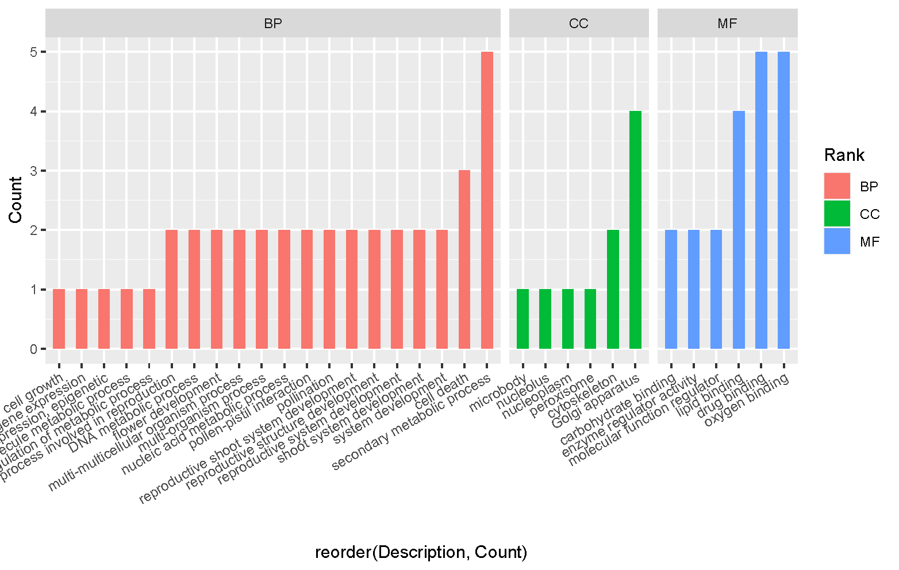

# GO 富集结果_ggplot2 绘图   

```r
library(ggplot2)
MSU_160_GO<-read.csv("C:\\Users\\zhuwengen\\Desktop\\tangyimiao\\GO\\MSU_160_GO.csv",stringsAsFactors = TRUE)
colnames(MSU_160_GO)      # 绘图主要使用"Rank"，"Description" ，"Count" 列
[1] "Rank"             "ID"               "Description"      "GeneRatio"        "BgRatio"         
[6] "pvalue"           "p.adjust"         "qvalue"           "geneID"           "Count"           
[11] "percent_of_genes"
```

MSU_160_GO 数据结构，如下图 
  
      

## 分面！绘图  
```r
ggplot(data = MSU_160_GO, mapping = aes(reorder(Description,Count),Count, fill=Rank)) +
        geom_bar(aes(fill=Rank),stat= 'identity', width = 0.5) +
        facet_grid(~Rank,space="free_x", scales="free_x") + 
         #换个角度显示，angle是控制刻度标签显示的角度 + 
        theme(axis.text.x = element_text(angle=30, hjust=1, vjust=1))
```

结果如下
      


